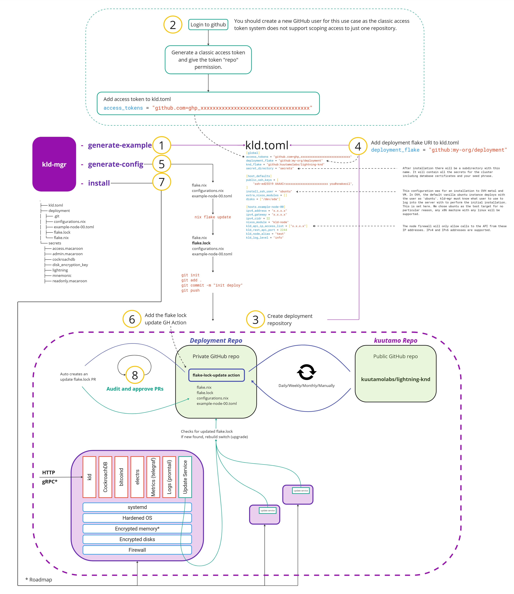

kuutamo is an open, turn-key, end-to-end solution for running best-in-class self-hosted nodes, anywhere.

# Lighting Service Provider (LSP) node cluster

**Nota bene**: kuutamo is bleeding edge decentralized financial infrastructure. Use with caution and only with funds you are prepared to lose.
If you want to put it into production and would like to discuss SRE overlay support, please get in touch with us at [opencore-support@kuutamo.co](mailto:opencore-support@kuutamo.co)

## Prerequisites

- 1 or 3 server(s)/node(s): Any Linux OS
- 1 workstation/local machine: Any Linux OS, MacOS.

## Components

- `kld-mgr` - A CLI tool that will SSH to your server(s) to perform the initial deployment
- `kld-cli` - A CLI tool that will talk to the `kld` API to support LSP operations (e.g. channel open)
- `kld` - kuutamo lightning daemon - our LSP router node software, built on [LDK](https://github.com/lightningdevkit)
- `cockroachdb` - Cockroach DB - a cloud-native, distributed SQL database
- `telegraf` - an agent for collecting and sending metrics to any URL that supports the [Prometheus's Remote Write API](https://prometheus.io/docs/prometheus/latest/configuration/configuration/#remote_write)

## Nix quickstart

kld-mgr:
```bash
nix run github:kuutamolabs/lightning-knd#kld-mgr -- help
```

kld-cli:
```bash
nix run github:kuutamolabs/lightning-knd#kld-cli -- help
```

## Install and in life operations

By default, nodes are locked down once installed and cannot be connected to over SSH. Nodes are upgraded using a GitOps model enabling complete system change auditability. 

The customized `nixos-updater` service checks for updates in your private deployment repository. If found, the cluster will upgrade.  
The maintainers of the deployment repository control when upgrades are accepted. They will review/audit, approve and merge the updated `flake.lock` PR.

SSH access and manual direct updates over SSH can be enabled for use in developemnt environments.

An example install and upgrade workflow is shown below using GitHub. Other Git platforms such as Bitbucket and Gitlab can be used inplace.  
`kld-mgr` requires root SSH access to server(s) to perform the initial install. In production, this should be executed on a hardened, trusted machine.   
Other cluster bootstrap methods can be used, such as via USB disk or PXE.



Notes:
- Step 0: Make a new directory
- Step 1: `nix run github:kuutamolabs/lightning-knd#kld-mgr generate-example > kld.toml`
- Step 2: Generate classic token with full repo permission, please refer to the [Github doc](https://docs.github.com/en/authentication/keeping-your-account-and-data-secure/managing-your-personal-access-tokens)
- Step 5: `nix run github:kuutamolabs/lightning-knd#kld-mgr generate-config ./deployment`
- Step 6.1: `mkdir -p ./deployment/.github/workflows`
- Step 6.2: `curl https://raw.githubusercontent.com/DeterminateSystems/update-flake-lock/main/.github/workflows/update.yml --output ./deployment/.github/workflows/upgrade.yml`
- Step 6.3: Please refer to [update-flake-lock](https://github.com/DeterminateSystems/update-flake-lock) to configure this Action to your requirements.
- Step 7: `nix run github:kuutamolabs/lightning-knd#kld-mgr install`
- Test: `nix run github:kuutamolabs/lightning-knd/mgr#kld-cli -- -t "x.x.x.x:2244" -c "secrets/lightning/ca.pem" -m "secrets/admin.macaroon get-info"`

## Installing Nix

1. Install the Nix package manager, if you don't already have it. https://zero-to-nix.com/start/install 

2. Enable `nix` command and [flakes](https://www.tweag.io/blog/2020-05-25-flakes/) features:

```shell
$ mkdir -p ~/.config/nix/ && printf 'experimental-features = nix-command flakes' >> ~/.config/nix/nix.conf
```
3. Trust pre-built binaries (optional):
```shell
$ printf 'trusted-substituters = https://cache.garnix.io https://cache.nixos.org/\ntrusted-public-keys = cache.garnix.io:CTFPyKSLcx5RMJKfLo5EEPUObbA78b0YQ2DTCJXqr9g= cache.nixos.org-1:6NCHdD59X431o0gWypbMrAURkbJ16ZPMQFGspcDShjY=' | sudo tee -a /etc/nix/nix.conf && sudo systemctl restart nix-daemon
```

4. Test
```shell 
$ nix run --refresh github:kuutamolabs/lightning-knd#kld-mgr -- help
```

## kld-cli

```shell
$ nix run github:kuutamolabs/lightning-knd#kld-cli -- help
```
```
Usage: kld-cli --target <TARGET> --cert-path <CERT_PATH> --macaroon-path <MACAROON_PATH> <COMMAND>

Commands:
  get-info                    Fetch information about this lightning node
  sign                        Creates a signature of the message using nodes secret key (message limit 65536 chars)
  get-balance                 Fetch confirmed and unconfirmed on-chain balance
  new-address                 Generates new on-chain address for receiving funds
  withdraw                    Send on-chain funds out of the wallet
  list-funds                  Show available funds from the internal wallet
  list-peers                  Fetch a list of this nodes peers
  connect-peer                Connect with a network peer
  disconnect-peer             Disconnect from a network peer
  list-channels               Fetch a list of this nodes open channels
  open-channel                Open a channel with another node
  set-channel-fee             Set channel fees
  close-channel               Close a channel
  network-nodes               Get node information from the network graph
  network-channels            Get channel information from the network graph
  fee-rates                   Return feerate estimates, either satoshi-per-kw or satoshi-per-kb
  keysend                     Pay a node without an invoice
  generate-invoice            Generate a bolt11 invoice for receiving a payment
  list-invoices               List all invoices
  pay-invoice                 Pay an invoice
  list-payments               List all payments
  estimate-channel-liquidity  Estimate channel liquidity to a target node
  local-remote-balance        Fetch the aggregate local and remote channel balances (msat) of the node
  get-fees                    Get node routing fees
  list-forwards               Fetch a list of the forwarded htlcs
  help                        Print this message or the help of the given subcommand(s)

Options:
  -t, --target <TARGET>                IP address or hostname of the target machine
  -c, --cert-path <CERT_PATH>          Path to the TLS cert of the target API
  -m, --macaroon-path <MACAROON_PATH>  Path to the macaroon for authenticating with the API
  -h, --help                           Print help
  -V, --version                        Print version

```

## Monitoring Settings

Although monitoring is not mandatory for deploying a node, it is highly recommended.
Configure the `self_monitoring_url`, `self_monitoring_username`, and `self_monitoring_password` fields of the host in the kld.toml.
